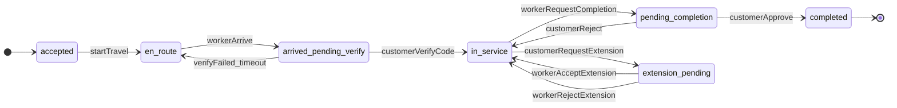

# Backend specification: realtime cleaning bookings (Laravel + Pusher)

This document describes what the **Laravel** API and **Pusher** (Laravel Broadcasting) should implement so the **worker (owner) app** and the **customer app** can support live tracking, arrival verification, completion approval, and service-extension requests.

It aligns with the current worker Flutter app in this repo.

---

## 1. Purpose and roles

| Role | App | Responsibilities |
|------|-----|------------------|
| **Worker** | `dllni_cleaninig_owner_app` (this repo) | Navigate to job, tap **"لقد وصلت"**, stream location when appropriate, finish work with **"إنهاء العمل"**, accept/reject **service extension** requests. |
| **Customer** | Separate customer app | See worker on map in realtime, confirm arrival (verification dialog), approve or reject **work completion**, request **service extension**. |

---

## 2. Stack assumptions

- **Backend:** Laravel (API routes, authentication—Sanctum or Passport as you already use—Eloquent models, policies).
- **Realtime:** **Pusher** via Laravel **Broadcasting** (`ShouldBroadcast` / `ShouldBroadcastNow`, `config/broadcasting.php` with `BROADCAST_DRIVER=pusher`).
- **Mobile (Flutter):** Does **not** use Laravel Echo (browser JS). Use a **Pusher Channels** client (e.g. `pusher_channels_flutter`) with the Pusher **app key**, **cluster**, **encrypted** private channels, and Laravel’s **`POST /broadcasting/auth`** for subscribing to `private-*` channels.
- **Push (optional):** The worker app already sends an **`fcm-token`** header (see `common_package` `TokenInterceptor`). Use **FCM** only if you need notifications when the app is backgrounded or not subscribed to Pusher. **Foreground / in-app realtime UX should rely on Pusher** where possible.

---

## 3. Current worker app touchpoints (this repo)

These files define today’s UX hooks; backend contracts should stay compatible or versioned.

| UI | File | Current behavior |
|----|------|-------------------|
| Map + **"لقد وصلت"** | `lib/features/orders/view/widgets/order_details/order_details_map_body.dart` | Dispatches `ArriveEvent` → **`POST /api/v1/cleaning-bookings/{id}/arrive`** (`lib/features/orders/data/source/orders_remote_data_source.dart`). |
| **"إنهاء العمل"** | `lib/features/orders/view/widgets/order_details/order_details_mission_body.dart` | Button dispatches **`CompleteOrderUsecaseEvent`** and calls **`POST /api/v1/cleaning-bookings/{id}/complete`**; realtime then drives the awaiting/approved/rejected UI states. |
| Extension list / actions | Orders feature | **`GET /api/v1/cleaning-time-warnings`**, **`POST .../cleaning-time-warnings/{id}/accept`**, **`POST .../cleaning-time-warnings/{id}/reject`**. Model fields include `bookingId`, `requestedMinutes`, etc. (`lib/features/orders/data/models/fetch_extension_requests_usecas_model.dart`). |

---

## 4. Laravel + Pusher realtime layer

### 4.1 Channels

Use **private** channels so Pusher enforces authorization.

**Recommended primary channel (booking-scoped):**

- Name: `private-cleaning-booking.{bookingId}`
- **Authorize in `routes/channels.php`:** return `true` only if the authenticated user is the **assigned worker** for that booking **or** the **customer** who owns the booking (plus support/admin if applicable).

**Optional worker-only channel** (if you prefer customers not to receive worker-targeted payloads on the same stream):

- Name: `private-cleaning-worker.{workerId}`
- Authorize: only that worker (and admins).

You can put **location updates** on `private-cleaning-booking.{bookingId}` (customer + worker both subscribed) and **worker-only modals** on `private-cleaning-worker.{workerId}` to reduce irrelevant traffic on the customer client.

### 4.2 Events

Implement Laravel events that implement `ShouldBroadcast` (or `ShouldBroadcastNow` when you must avoid queue latency).

For each event, define:

- `broadcastOn()` → channel(s)
- `broadcastAs()` → stable **event name** for mobile (e.g. `WorkerLocationUpdated`)
- `broadcastWith()` → minimal JSON (include `bookingId`, `type` or event name, and a **`version`** integer for schema evolution)

### 4.3 Worker GPS: HTTP first, then broadcast

High-frequency GPS should **not** go through FCM.

1. Worker app calls **`POST` or `PATCH`** a dedicated endpoint (suggested):  
   `POST /api/v1/cleaning-bookings/{id}/location`  
   Body: `{ "latitude": number, "longitude": number, "recordedAt": ISO8601, "heading": number|null, "accuracy": number|null }`

2. Laravel validates:

   - User is the assigned worker.
   - Booking status allows tracking (e.g. after **start-travel** / en-route, until **completed** or **cancelled**).

3. **Throttle / debounce** server-side (e.g. accept at most one update per **2–5 seconds** per booking) to control **Pusher message volume** and cost.

4. Optionally persist **last known location** for reconnect (short TTL).

5. **`broadcast(new WorkerLocationUpdated(...))`** to `private-cleaning-booking.{bookingId}`.

### 4.4 Channel authorization (`/broadcasting/auth`)

- Laravel’s default **`POST /broadcasting/auth`** accepts the channel name and socket id.
- For **API/mobile**, use **Bearer token** (e.g. Sanctum personal access token) so `auth:sanctum` (or your guard) resolves the user before `channels.php` runs.
- Document for mobile teams: same base URL as API, credentials, and required headers when subscribing to private channels.

### 4.5 Pusher limits

Call out in runbooks: daily message quotas, max payload size, and concurrency. Adjust GPS debounce and payload size (omit redundant fields) accordingly.

---

## 5. Feature A: Live worker on customer map

**Goal:** While the job is active, the **customer** sees the **worker** move on a map in near realtime.

| Step | Owner | Action |
|------|--------|--------|
| 1 | Worker | Sends throttled location updates to Laravel (see §4.3). |
| 2 | Laravel | Validates, debounces, optionally stores last position, broadcasts `WorkerLocationUpdated`. |
| 3 | Customer | Subscribes to `private-cleaning-booking.{bookingId}`, listens for `WorkerLocationUpdated`. |

**Suggested broadcast payload (`WorkerLocationUpdated`):**

```json
{
  "bookingId": 123,
  "version": 1,
  "latitude": 24.7136,
  "longitude": 46.6753,
  "recordedAt": "2026-04-21T12:34:56.000Z",
  "heading": null,
  "accuracy": 12.5
}
```

**Security:** Only worker + customer for that booking may authorize the booking channel.

---

## 6. Feature B: Arrival verification ("لقد وصلت")

**Goal:** When the worker taps **"لقد وصلت"**, the worker sees a **verification code**. The customer gets a **realtime prompt** to enter that code (or confirm arrival per your product rule). After successful verification, set **`arrivedAt`** (already used by the mission timer in `order_details_mission_body.dart`).

### 6.1 REST (extend existing arrive or add steps)

On successful **`POST /api/v1/cleaning-bookings/{id}/arrive`** (or a follow-up endpoint):

1. Generate a **short-lived numeric code** (e.g. 4–6 digits) and store it hashed or encrypted with **expiry** (e.g. 10–15 minutes).
2. **HTTP response to worker** must include the **plain code** (and `expiresAt`) so the worker UI can display it.
3. **Do not** put the plain code in a Pusher event visible to the customer if the product requires the customer to **read the code from the worker’s screen** (in-person verification).  
   - **Option A (recommended for in-person):** Pusher event to customer: `ArrivalVerificationRequested` with `{ bookingId, message, expiresAt }` only—**no code**. Customer enters what the worker shows.  
   - **Option B:** If the code is delivered through a separate secure channel to the customer, document that explicitly (unusual for this flow).

### 6.2 Pusher

- Event: e.g. `ArrivalVerificationRequested`
- Channel: `private-cleaning-booking.{bookingId}`
- Consumer: **customer** (worker may also listen for UI sync if needed)

**Example customer payload (Option A):**

```json
{
  "bookingId": 123,
  "version": 1,
  "expiresAt": "2026-04-21T12:45:00.000Z",
  "hint": "أدخل الرمز الذي يظهر لمقدم الخدمة"
}
```

### 6.3 Customer verifies

**Suggested endpoint:**

- `POST /api/v1/cleaning-bookings/{id}/verify-arrival`  
  Body: `{ "code": "123456" }`

On success:

- Persist **`arrivedAt`**.
- Broadcast e.g. `ArrivalVerified` to `private-cleaning-booking.{bookingId}` so the worker app can proceed to the mission step.

On failure:

- Return clear errors; **rate-limit** attempts.

### 6.4 Idempotency

If **arrive** is retried, define whether the code is regenerated or the previous code remains valid until expiry.

---

## 7. Feature C: Finish work → customer accepts or rejects ("إنهاء العمل")

**Goal:** Worker taps **"إنهاء العمل"**; **customer** receives a **realtime** request to **accept** work or **reject / ask for fixes**; worker sees the outcome on **Pusher** (FCM optional if background).

### 7.1 Two-phase completion (recommended)

| Phase | Endpoint (suggested) | Actor |
|-------|----------------------|--------|
| Request completion | `POST /api/v1/cleaning-bookings/{id}/request-completion` | Worker |
| Approve | `POST /api/v1/cleaning-bookings/{id}/approve-completion` | Customer |
| Reject / needs fixes | `POST /api/v1/cleaning-bookings/{id}/reject-completion` | Customer |

**Worker `request-completion` body (example):**

```json
{
  "tasksCompleted": [ { "taskKey": "bedrooms", "done": true } ],
  "notes": "optional",
  "photoUrls": []
}
```

Laravel sets booking status to e.g. **`pending_customer_confirmation`** and broadcasts:

- Event: `CompletionReviewRequested`
- Channel: `private-cleaning-booking.{bookingId}`
- Payload: `{ bookingId, version, summary, requestedAt }` (minimal fields for the customer dialog)

**Customer approves** → then call existing-style completion logic (e.g. internal equivalent of **`POST .../complete`**) so **`workFinishedAt`** is set (see `CompleteOrderUsecaseModelData`).

**Customer rejects** → status returns to **`in_progress`**, optional `message` to worker; broadcast `CompletionRejected` to worker (via `private-cleaning-booking.{bookingId}` and/or `private-cleaning-worker.{workerId}`).

**Worker listens for decision:**

- Event: `CompletionDecisionMade`  
- Payload: `{ bookingId, version, decision: "approved"|"rejected", message?: string }`

---

## 8. Feature D: Service extension ("طلب تمديد الخدمة")

**Goal:** When the **customer** requests more time, the **worker** sees a realtime modal (your design: extra profit, payment method, approve / reject with apology message up to ~150 characters).

### 8.1 Data model

Extend or reuse **`cleaning-time-warnings`** (already exposed as `GET /api/v1/cleaning-time-warnings` with `bookingId`, `requestedMinutes`, etc.) so records include at least:

- `id` (warning id)
- `bookingId`
- `requestedMinutes` (or hours + minutes)
- **Customer display name**
- **Additional amount** (worker earnings / total—define clearly)
- **Payment method** (e.g. cash on delivery)
- **Status** (pending / accepted / rejected)

### 8.2 Pusher

When a pending extension is created for an assigned worker:

- Event: `ServiceExtensionRequested`
- Channel: **`private-cleaning-worker.{workerId}`** and/or **`private-cleaning-booking.{bookingId}`**
- Payload example:

```json
{
  "warningId": 45,
  "bookingId": 123,
  "version": 1,
  "customerName": "أحمد الأحمد",
  "requestedMinutes": 60,
  "additionalAmount": 80.00,
  "currency": "SYP",
  "paymentMethod": "cash_on_delivery"
}
```

### 8.3 REST (existing)

Worker continues to use:

- `POST /api/v1/cleaning-time-warnings/{id}/accept`
- `POST /api/v1/cleaning-time-warnings/{id}/reject`  
  Reject body should support **`message`** (apology / explanation), max length ~150 characters, stored and optionally forwarded to customer.

**FCM** optional for background delivery of the same logical event.

---

## 9. Event catalog (Pusher)

| `broadcastAs()` name | Producer | Typical consumer | Key fields | Idempotency note |
|----------------------|----------|------------------|------------|------------------|
| `WorkerLocationUpdated` | Laravel (after location POST) | Customer (map) | `bookingId`, `lat`, `lng`, `recordedAt`, `version` | Debounce; same `recordedAt` optional dedup |
| `ArrivalVerificationRequested` | Laravel (after arrive) | Customer | `bookingId`, `expiresAt`, `version` | New arrive may rotate code |
| `ArrivalVerified` | Laravel (after verify-arrival) | Worker | `bookingId`, `arrivedAt`, `version` | Safe to ignore duplicate |
| `CompletionReviewRequested` | Laravel (after request-completion) | Customer | `bookingId`, `summary`, `version` | One active review per booking |
| `CompletionDecisionMade` | Laravel (after approve/reject) | Worker | `bookingId`, `decision`, `message?`, `version` | Include decision id or timestamp |
| `ServiceExtensionRequested` | Laravel (after customer creates warning) | Worker | `warningId`, `bookingId`, pricing fields, `version` | `warningId` unique |

---

## 10. Booking state machine (high level)



*(Exact status strings should match your Laravel `enum` / DB column; rename nodes to fit.)*

---

## 11. Open decisions (Laravel / product)

1. **Auth for `/broadcasting/auth`:** Sanctum personal access token vs session; CORS and mobile headers.
2. **Channel split:** all on `private-cleaning-booking.{id}` vs worker-only events on `private-cleaning-worker.{workerId}`.
3. **Arrival code UX:** code **only on worker device** (customer types it) vs any digital delivery to customer.
4. **Code length and TTL** for arrival verification.
5. **Completion vs payment:** approve completion before/after payment capture; whether `complete` stays a separate internal step.
6. **GPS interval vs Pusher plan** (debounce window, max concurrent bookings).

---

## 12. Summary checklist for backend

- [ ] Configure **Pusher** and Laravel **Broadcasting**.
- [ ] Implement **`routes/channels.php`** for `private-cleaning-booking.{bookingId}` (and optional `private-cleaning-worker.{workerId}`).
- [ ] Expose **`POST /broadcasting/auth`** for mobile with API guard.
- [ ] Throttled **worker location** endpoint + **`WorkerLocationUpdated`** event.
- [ ] **Arrival** response includes code for worker; **Pusher** + **`verify-arrival`** + **`ArrivalVerified`**.
- [ ] **request-completion** / **approve-completion** / **reject-completion** + Pusher events.
- [ ] **Extension** resource enriched + **`ServiceExtensionRequested`**; keep **accept/reject** REST.
- [ ] Optional **FCM** mirroring for background (reuse `fcm-token` header).

---

*Document generated for coordination between Laravel backend and Flutter apps. Update event names and URLs to match your final API versioning (`/api/v1/...`).*
