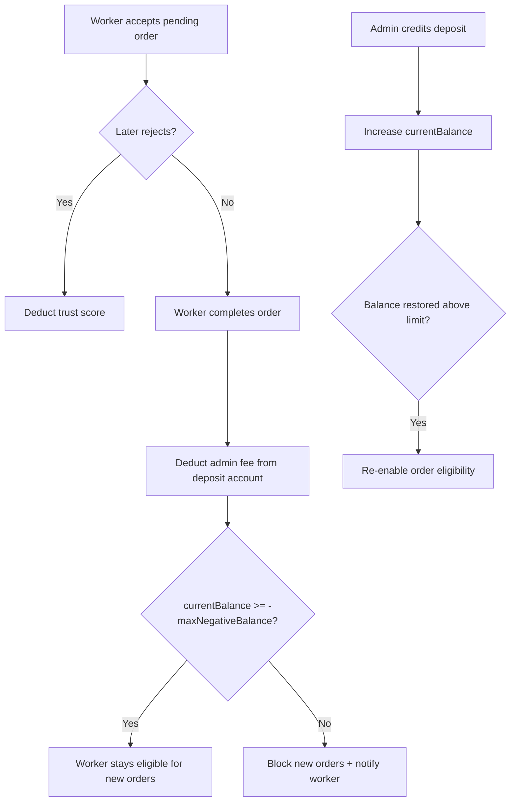

# Worker Trust Score & Deposit Account — Laravel Backend Specification

This document describes the **Laravel backend** behavior required by the **Dllni Cleaning Owner App** (worker mobile app) for:

1. Reducing **trust score** when a worker rejects an order they had already accepted.
2. Managing a worker **deposit account** (cash paid to admin, credited from the admin dashboard).
3. Deducting **admin fees** from the worker account (balance may go **negative**).
4. Enforcing a configurable **maximum negative balance** — blocking new order dispatch and notifying the worker when the limit is reached.

It aligns with the Flutter models and endpoints already wired in this repo.

---

## 1. Business overview

| Concept | Description |
|---------|-------------|
| **Trust score** | Percentage (0–100) shown in the worker app (`trustScore` on profile). Penalized when the worker rejects an order after accepting it. |
| **Deposit account** | Prepaid balance the worker maintains with the platform. Worker pays admin offline; admin credits the account from the dashboard. |
| **Admin fee** | Platform commission deducted from the worker deposit account when an order is completed (or at the configured billing moment). |
| **Negative balance** | Allowed while `currentBalance >= -maxNegativeBalance`. Admin fee is charged to the worker even if balance is zero — the account goes negative. |
| **Order eligibility** | Worker is eligible for **new** order offers only when deposit rules and trust/suspension rules pass. |

### High-level flow



---

## 2. Mobile app touchpoints (this repo)

| Feature | Flutter file / endpoint |
|---------|-------------------------|
| Trust score display | `lib/features/profile/data/models/fetch_worker_profile_usecase_model.dart` → `GET /api/v1/cleaning/worker/profile` |
| Reject order | `lib/features/orders/data/source/orders_remote_data_source.dart` → `POST /api/v1/cleaning-bookings/{id}/reject` |
| Deposit account | `lib/features/profile/data/models/fetch_deposit_account_usecase_model.dart` → `GET /api/v1/cleaning/worker/account/deposit` |
| Deposit transactions | `lib/features/profile/data/models/fetch_deposit_transactions_usecase_model.dart` → `GET /api/v1/cleaning/worker/account/deposit/transactions` |
| Wallet UI | `lib/features/profile/view/screens/wallet_screen.dart` |
| Finance summary (wallet top card) | `lib/features/home/data/models/fetch_home_page_usecase_model.dart` → `GET /api/v1/cleaning/worker/homepage` |

The mobile app already parses camelCase and snake_case field names.

---

## 3. Wallet screen field dictionary (authoritative)

The wallet screen (`wallet_screen.dart`) shows two sections. Below is the **product meaning** of each Arabic label and the **exact API field** the Flutter app reads today.

### Quick reference (product owner definitions)

| Arabic label | What it means for the worker |
|--------------|------------------------------|
| **الايرادات** | All money the worker earned from completed work (total order value). |
| **تم ايداعه للادارة** | All cash the worker physically gave to admin; admin credits it from the dashboard. |
| **نسبة الادارة من الارباح** | For every order, admin keeps a share — this is the **sum** of all admin shares. |
| **اجمالي عدد الطلبات المكتملة** | How many orders the worker has completed. |
| **الرصيد الحالي** | Money in the app account, or debt to admin if negative. |
| **الحد الأدنى المطلوب** | Amount admin requires before the worker can **start work**. |
| **اجمالي الايداع** | Total cash paid to admin since the worker started. |
| **اجمالي السحب** | Total cash the worker took back from their balance. |

### 3.1 Finance summary card — `ملخص المبالغ`

**Source endpoint:** `GET /api/v1/cleaning/worker/homepage`  
**JSON path:** root `amountSummary` object + root `completedCount`

| Arabic label (UI) | API field | Type | Business meaning (backend must return) |
|-------------------|-----------|------|----------------------------------------|
| **الايرادات** | `amountSummary.grossInvoicesAmount` | decimal | **Total revenue** from all work the worker has done — the full invoice/gross amount across completed orders (worker share + admin share). Sum of order totals for this worker. |
| **تم ايداعه للادارة** | `amountSummary.workerAmount` | decimal | **Total cash the worker physically gave to admin** and admin credited from the dashboard. This is **not** worker profit — it is money paid **to** the platform/admin. |
| **نسبة الادارة من الارباح** | `amountSummary.adminAmount` | decimal | **Total admin commission** taken from all orders — for every completed order, the platform keeps a part; this field is the **sum of all admin parts** across all those orders. |
| **اجمالي عدد الطلبات المكتملة** | `completedCount` | int | **Total completed orders** for this worker (lifetime or same scope as the amounts above — keep scopes consistent). |

#### Example `amountSummary` payload

```json
{
  "completedCount": 30,
  "amountSummary": {
    "period": "all_time",
    "currency": "SYP",
    "grossInvoicesAmount": 10400000,
    "workerAmount": 3810000,
    "adminAmount": 1950000
  }
}
```

> Example: `grossInvoicesAmount` (10400000) = total order value the worker completed. `adminAmount` (1950000) = admin’s cumulative cut. `workerAmount` (3810000) = cash the worker paid admin — **not** `grossInvoicesAmount - adminAmount`.

#### Backend calculation rules

```php
// Per completed booking for this worker:
$grossInvoicesAmount += $booking->gross_total;      // full order value (الايرادات)
$adminAmount         += $booking->admin_fee;         // admin cut (نسبة الادارة)
// workerAmount is NOT (gross - admin). It comes from deposit credits:
$workerAmount        = WorkerDepositTransaction::where('worker_id', $id)
                        ->where('type', 'deposit')->sum('amount');
```

> **Naming note:** `amountSummary.workerAmount` is used in Flutter for **تم ايداعه للادارة** (cash deposited to admin). The JSON key name is legacy — backend should treat it as **totalDepositedToAdmin**, not worker earnings.

| Field | Must equal |
|-------|------------|
| `grossInvoicesAmount` | Σ order gross totals (completed) |
| `adminAmount` | Σ `admin_fee` per completed order |
| `workerAmount` (UI: تم ايداعه للادارة) | Σ admin-dashboard **deposit** credits (cash worker paid admin) |

Use the same `period` for all four values (`all_time` recommended for wallet screen, or document the period in `amountSummary.period`).

---

### 3.2 Security deposit card — `حالة مبلغ التأمين`

**Source endpoint:** `GET /api/v1/cleaning/worker/account/deposit`

| Arabic label (UI) | API field | Type | Business meaning (backend must return) |
|-------------------|-----------|------|----------------------------------------|
| **الرصيد الحالي** | `currentBalance` | decimal | Tells the worker whether they have prepaid money in the app or the admin is owed money. **Positive** = worker has credit. **Negative** = admin wants money from the worker. |
| **الحد الأدنى المطلوب** | `minimumRequired` | decimal | Threshold set by **admin in dashboard**. Worker **must pay at least this amount to admin** (via offline payment + admin credit) before they can **start work** on orders. Enforce on `start-travel` / `start-work` — not only on dispatch. |
| **اجمالي الايداع** | `depositedTotal` | decimal | **Lifetime total** of cash the worker paid to admin (sum of all `deposit` transactions from first day of work until now). Same value as **تم ايداعه للادارة** on the finance summary card. |
| **إجمالي السحب** | `withdrawnTotal` | decimal | **Lifetime total** of money the worker **took out** of their account balance (cash returned to worker by admin — `withdrawal` transactions). Does **not** include admin-fee debits; those are platform charges, not worker cash-outs. |

#### Balance relationship

```
currentBalance = depositedTotal - withdrawnTotal - adminFeesChargedTotal
```

Where `adminFeesChargedTotal` = Σ `admin_fee` transaction amounts (reduces balance but is **not** counted in `withdrawnTotal`).

#### Example

| Event | depositedTotal | withdrawnTotal | admin fees | currentBalance |
|-------|----------------|----------------|------------|----------------|
| Worker pays admin 500 cash | 500 | 0 | 0 | **500** |
| Order completes, admin fee 80 | 500 | 0 | 80 | **420** |
| Worker takes 100 cash back | 500 | 100 | 80 | **320** |
| More fees than balance | 500 | 100 | 600 | **-200** (admin owed 200) |

When `currentBalance` is negative, the worker owes the platform; they may still receive orders until `maxNegativeBalance` is exceeded (see §5.4).

#### `minimumRequired` enforcement

```php
// Before allowing start-travel or start-work:
if ($account->deposited_total < $account->minimum_required) {
    throw new DepositMinimumNotMetException(
        'Worker must deposit at least {minimumRequired} before starting work.'
    );
}
```

Alternative: compare `currentBalance` vs `minimumRequired` if minimum is meant as **maintained balance** not **lifetime deposited**. Product intent: worker **pays admin** this amount — use `deposited_total >= minimum_required` (or `current_balance >= minimum_required` if fees can consume the deposit). Document the chosen rule in admin settings; recommended: **`deposited_total >= minimum_required`** so paying once satisfies the gate even after fees.

---

## 4. Trust score — reject accepted order

### 4.1 When to apply the penalty

Apply a trust-score deduction **only** when **all** of the following are true:

1. Authenticated user is the assigned worker for the booking.
2. Booking status is `pending` (order not yet started / not cancelled).
3. The worker’s assignment for this booking was previously **accepted** (`assignment.status = accepted` or `accepted_at` is set).
4. Worker calls reject (not a system/admin cancel).

> Do **not** penalize rejecting an order the worker has **not** yet accepted (normal decline of a new offer).

This matches the app’s `OrderLifecyclePolicy`: accept/reject is shown for pending orders without a prior acceptance; after acceptance the worker is in “accepted waiting” state but may still reject in some flows — that rejection must cost trust.

### 4.2 Endpoint (existing)

| Property | Value |
|----------|-------|
| **Method** | `POST` |
| **URL** | `/api/v1/cleaning-bookings/{id}/reject` |
| **Auth** | Bearer token (worker guard) |

#### Suggested success response (200)

Extend the current payload to include updated trust data (optional but recommended):

```json
{
  "data": {
    "id": 1234,
    "status": "pending",
    "cancellationReason": "worker_rejected_after_accept",
    "trustScore": 82,
    "trustScoreDelta": -5
  }
}
```

| Field | Type | Notes |
|-------|------|-------|
| `trustScore` | int | Worker trust score **after** penalty |
| `trustScoreDelta` | int | Negative value applied (e.g. `-5`) |

Flutter today reads `id`, `status`, `cancellationReason` only; extra fields are safe to add.

### 4.3 Laravel implementation notes

```php
// Pseudocode inside RejectCleaningBookingAction / controller
if ($assignment->wasAccepted()) {
    $penalty = (int) config('cleaning.trust.reject_after_accept_penalty', 5);
    $worker->trust_score = max(0, $worker->trust_score - $penalty);
    $worker->save();

    TrustScoreLog::create([
        'worker_id' => $worker->id,
        'booking_id' => $booking->id,
        'delta' => -$penalty,
        'reason' => 'reject_after_accept',
    ]);
}
```

#### Admin-configurable settings (dashboard)

| Setting key | Type | Default | Description |
|-------------|------|---------|-------------|
| `trust.reject_after_accept_penalty` | int | `5` | Points deducted per reject-after-accept |
| `trust.minimum_for_dispatch` | int | `0` | Optional: minimum trust to receive offers |

Expose these in the admin **Cleaning settings** screen.

#### Suggested table: `worker_trust_score_logs`

```sql
CREATE TABLE worker_trust_score_logs (
    id BIGINT UNSIGNED AUTO_INCREMENT PRIMARY KEY,
    worker_id BIGINT UNSIGNED NOT NULL,
    cleaning_booking_id BIGINT UNSIGNED NULL,
    delta INT NOT NULL,
    score_before INT NOT NULL,
    score_after INT NOT NULL,
    reason VARCHAR(64) NOT NULL,
    created_at TIMESTAMP NULL,
    updated_at TIMESTAMP NULL,
    INDEX idx_worker_id (worker_id),
    INDEX idx_booking_id (cleaning_booking_id)
);
```

Ensure `GET /api/v1/cleaning/worker/profile` returns the updated `trustScore` on the next fetch.

---

## 5. Worker deposit account

### 5.1 Model semantics

Each cleaning worker has **one** deposit account row. Field meanings match §3.2 (wallet UI).

| Field | DB column | Type | Description |
|-------|-----------|------|-------------|
| `workerId` | `worker_id` | int | FK to workers |
| `currentBalance` | `current_balance` | decimal(12,2) | **الرصيد الحالي** — may be **negative** (admin is owed money) |
| `depositedTotal` | `deposited_total` | decimal(12,2) | **اجمالي الايداع** — lifetime cash worker paid admin |
| `withdrawnTotal` | `withdrawn_total` | decimal(12,2) | **اجمالي السحب** — lifetime cash worker took from account (not admin fees) |
| `minimumRequired` | `minimum_required` | decimal(12,2) | **الحد الأدنى المطلوب** — admin-set; blocks **start work** until worker has paid at least this amount to admin (`depositedTotal >= minimumRequired`) |
| `maxNegativeBalance` | `max_negative_balance` | decimal(12,2) | How far below zero is allowed (e.g. `500` → floor is `-500`) |
| `status` | `status` | string | `active`, `insufficient_balance`, `suspended` |
| `exceedanceAmount` | — (computed) | decimal | Amount **past** the negative limit (see §5.4) |
| `isEligibleForNewRequests` | — (computed) | bool | Whether worker may receive new order offers |

### 5.2 Worker API — get account (existing)

| Property | Value |
|----------|-------|
| **Method** | `GET` |
| **URL** | `/api/v1/cleaning/worker/account/deposit` |
| **Auth** | Bearer token (worker guard) |

#### Success response (200)

```json
{
  "workerId": 42,
  "currentBalance": -120.5,
  "depositedTotal": 381.0,
  "withdrawnTotal": 501.5,
  "minimumRequired": 381.0,
  "maxNegativeBalance": 500.0,
  "status": "active",
  "exceedanceAmount": 0,
  "isEligibleForNewRequests": true,
  "createdAt": "2026-05-20T10:30:00.000000Z",
  "updatedAt": "2026-06-18T09:15:00.000000Z"
}
```

When the worker is **blocked** (balance below allowed floor):

```json
{
  "workerId": 42,
  "currentBalance": -620.5,
  "depositedTotal": 381.0,
  "withdrawnTotal": 1001.5,
  "minimumRequired": 381.0,
  "maxNegativeBalance": 500.0,
  "status": "insufficient_balance",
  "exceedanceAmount": 120.5,
  "isEligibleForNewRequests": false,
  "createdAt": "2026-05-20T10:30:00.000000Z",
  "updatedAt": "2026-06-18T09:15:00.000000Z"
}
```

> **Note:** `maxNegativeBalance` is new for the backend. The Flutter parser ignores unknown fields; add it when convenient. Eligibility is driven by `isEligibleForNewRequests`, `status`, and `exceedanceAmount` (already parsed).

### 5.3 Worker API — transactions (existing)

| Property | Value |
|----------|-------|
| **Method** | `GET` |
| **URL** | `/api/v1/cleaning/worker/account/deposit/transactions` |

#### Query parameters

| Parameter | Type | Required | Description |
|-----------|------|----------|-------------|
| `page` | int | No | Default `1` |
| `perPage` | int | No | Default `20`, max `50` |
| `type` | string | No | Filter: `deposit`, `withdrawal`, `admin_fee` |

#### Success response (200)

```json
{
  "data": [
    {
      "id": 1001,
      "type": "deposit",
      "amount": 200.0,
      "balanceBefore": -50.0,
      "balanceAfter": 150.0,
      "reference": "ADM-CR-2026-001",
      "notes": "Cash received from worker",
      "createdAt": "2026-06-18T08:00:00.000000Z",
      "updatedAt": "2026-06-18T08:00:00.000000Z"
    },
    {
      "id": 1002,
      "type": "admin_fee",
      "amount": 45.0,
      "balanceBefore": 150.0,
      "balanceAfter": 105.0,
      "reference": "BOOKING-9876",
      "notes": "Admin fee for completed booking #9876",
      "createdAt": "2026-06-18T09:00:00.000000Z",
      "updatedAt": "2026-06-18T09:00:00.000000Z"
    }
  ],
  "meta": {
    "currentPage": 1,
    "lastPage": 1,
    "perPage": 20,
    "total": 2
  }
}
```

#### Transaction types

| `type` | Direction | When |
|--------|-----------|------|
| `deposit` | Credit (+) | Admin credits worker after offline payment |
| `withdrawal` | Debit (−) | Worker cash-out / admin pays worker — increments `withdrawnTotal` |
| `admin_fee` | Debit (−) | Platform fee on order completion — reduces `currentBalance` only (not `withdrawnTotal`) |

Amount is always **positive**; type determines sign when applying to balance.

### 5.4 Eligibility & status computation

```php
$floor = -1 * (float) $account->max_negative_balance;

$isEligible = $account->current_balance >= $floor
    && $worker->is_active
    && ! $worker->is_suspended
    && ($worker->trust_score >= config('cleaning.trust.minimum_for_dispatch', 0));

$exceedance = $isEligible
    ? 0
    : max(0, $floor - $account->current_balance); // how far below the floor

$status = match (true) {
    $worker->is_suspended => 'suspended',
    ! $isEligible && $account->current_balance < $floor => 'insufficient_balance',
    default => 'active',
};
```

Return `isEligibleForNewRequests` using the same rules in:

- `GET /api/v1/cleaning/worker/account/deposit`
- `GET /api/v1/cleaning/worker/profile` (recommended: add `isEligibleForNewRequests` there too for home-screen checks)
- Internal order-dispatch query (mandatory)

---

## 6. Admin dashboard APIs

These endpoints are **admin-only** (not called by the worker app today).

### 6.1 Credit worker deposit (worker paid admin offline)

| Property | Value |
|----------|-------|
| **Method** | `POST` |
| **URL** | `/api/v1/admin/cleaning/workers/{workerId}/account/deposit` |

#### Request body

```json
{
  "amount": 200.0,
  "reference": "CASH-2026-06-18-001",
  "notes": "Cash received at office"
}
```

#### Behavior

1. Validate `amount > 0`.
2. In a DB transaction:
   - `balance_before = current_balance`
   - `current_balance += amount`
   - `deposited_total += amount`
   - Insert `deposit` transaction row.
3. Recompute eligibility.
4. If worker was blocked and is now eligible → send **“account restored”** notification (§8).
5. Return updated account snapshot.

### 6.2 Manual debit / correction

| Property | Value |
|----------|-------|
| **Method** | `POST` |
| **URL** | `/api/v1/admin/cleaning/workers/{workerId}/account/withdraw` |

Same shape as credit; creates `withdrawal` transaction and decreases `current_balance`.

### 6.3 Set global max negative balance (default for new workers)

| Property | Value |
|----------|-------|
| **Method** | `PUT` |
| **URL** | `/api/v1/admin/cleaning/settings/deposit` |

```json
{
  "defaultMaxNegativeBalance": 500.0,
  "defaultMinimumRequired": 381.0,
  "trustRejectAfterAcceptPenalty": 5
}
```

### 6.4 Override per worker

| Property | Value |
|----------|-------|
| **Method** | `PUT` |
| **URL** | `/api/v1/admin/cleaning/workers/{workerId}/account/settings` |

```json
{
  "maxNegativeBalance": 300.0,
  "minimumRequired": 381.0
}
```

After lowering `maxNegativeBalance`, re-run eligibility for that worker immediately.

---

## 7. Admin fee deduction (order completion)

### 7.1 When to charge

Charge the admin fee when the booking reaches the configured settlement state (recommended: **`completed`** and payment confirmed).

```php
DB::transaction(function () use ($booking, $worker, $adminFee) {
    $account = WorkerDepositAccount::lockForUpdate()
        ->firstOrCreate(['worker_id' => $worker->id]);

    $before = $account->current_balance;
    $account->current_balance -= $adminFee;
    // Do NOT add to withdrawn_total — admin fees are not worker withdrawals
    $account->save();

    WorkerDepositTransaction::create([
        'worker_id' => $worker->id,
        'type' => 'admin_fee',
        'amount' => $adminFee,
        'balance_before' => $before,
        'balance_after' => $account->current_balance,
        'reference' => 'BOOKING-' . $booking->id,
        'notes' => 'Admin fee for completed booking',
        'cleaning_booking_id' => $booking->id,
    ]);

    $this->depositEligibilityService->syncWorker($worker, $account);
});
```

### 7.2 Important rules

- **Do not** block order **completion** when balance is insufficient — only block **new** order dispatch.
- Balance **may go negative** down to `-maxNegativeBalance`.
- Fee amount comes from existing booking/pricing logic (`amountSummary.adminAmount` / **نسبة الادارة من الارباح** uses the same commission source).

### 7.3 Homepage aggregates (finance summary card)

On each completed booking, update rolling totals used by `GET /api/v1/cleaning/worker/homepage`:

```php
// After booking completion
$summary->gross_invoices_amount += $booking->gross_total;   // الايرادات
$summary->admin_amount         += $booking->admin_fee;       // نسبة الادارة من الارباح
$summary->completed_count       += 1;                        // اجمالي عدد الطلبات المكتملة

// تم ايداعه للادارة — NOT incremented per order; synced from deposit account:
$summary->worker_amount = $account->deposited_total;        // same as depositedTotal
```

`amountSummary.workerAmount` must always equal `worker_deposit_accounts.deposited_total` (cash worker paid admin). Do **not** set it to order earnings or `gross - admin`.

---

## 8. Order dispatch — exclude ineligible workers

When building the candidate worker list for a new pending booking (push / Pusher / assignment job), **exclude** workers where `isEligibleForNewRequests === false`.

```php
Worker::query()
    ->where('is_active', true)
    ->whereHas('depositAccount', fn ($q) => $q->whereColumn(
        'current_balance', '>=', DB::raw('-max_negative_balance')
    ))
    // also trust_score, zones, availability, etc.
```

Workers already on an active job are governed by existing assignment rules; this gate applies to **new** offers only.

---

## 9. Notifications

Send via existing FCM + in-app notifications infrastructure when:

| Event | Trigger | Suggested title (AR) | Payload `type` |
|-------|---------|----------------------|----------------|
| Negative limit reached | `current_balance < -max_negative_balance` after fee or settings change | لن تتلقى طلبات جديدة | `deposit_limit_reached` |
| Account restored | Balance raised above floor after admin credit | تم استعادة حسابك | `deposit_account_restored` |
| Trust penalty | Reject after accept | تم خصم من نقاط الثقة | `trust_score_penalty` |

### Example FCM data payload

```json
{
  "type": "deposit_limit_reached",
  "workerId": "42",
  "currentBalance": "-620.5",
  "maxNegativeBalance": "500",
  "exceedanceAmount": "120.5",
  "message": "لن تتلقى أي طلب جديد حتى تقوم بسداد المبلغ المستحق."
}
```

Deduplicate: send `deposit_limit_reached` **once** when crossing the threshold, not on every subsequent fee while still blocked.

---

## 10. Suggested database schema

### `worker_deposit_accounts`

```sql
CREATE TABLE worker_deposit_accounts (
    id BIGINT UNSIGNED AUTO_INCREMENT PRIMARY KEY,
    worker_id BIGINT UNSIGNED NOT NULL UNIQUE,
    current_balance DECIMAL(12,2) NOT NULL DEFAULT 0,
    deposited_total DECIMAL(12,2) NOT NULL DEFAULT 0,
    withdrawn_total DECIMAL(12,2) NOT NULL DEFAULT 0,
    minimum_required DECIMAL(12,2) NOT NULL DEFAULT 0,
    max_negative_balance DECIMAL(12,2) NOT NULL DEFAULT 500,
    created_at TIMESTAMP NULL,
    updated_at TIMESTAMP NULL,
    INDEX idx_current_balance (current_balance)
);
```

### `worker_deposit_transactions`

```sql
CREATE TABLE worker_deposit_transactions (
    id BIGINT UNSIGNED AUTO_INCREMENT PRIMARY KEY,
    worker_id BIGINT UNSIGNED NOT NULL,
    cleaning_booking_id BIGINT UNSIGNED NULL,
    type ENUM('deposit', 'withdrawal', 'admin_fee') NOT NULL,
    amount DECIMAL(12,2) NOT NULL,
    balance_before DECIMAL(12,2) NOT NULL,
    balance_after DECIMAL(12,2) NOT NULL,
    reference VARCHAR(128) NULL,
    notes TEXT NULL,
    created_by_admin_id BIGINT UNSIGNED NULL,
    created_at TIMESTAMP NULL,
    updated_at TIMESTAMP NULL,
    INDEX idx_worker_id (worker_id),
    INDEX idx_type (type),
    INDEX idx_booking_id (cleaning_booking_id)
);
```

### Workers table (if not present)

```sql
ALTER TABLE workers ADD COLUMN trust_score INT UNSIGNED NOT NULL DEFAULT 100;
```

---

## 11. Laravel structure (suggested)

```
app/
  Domain/Cleaning/
    Actions/
      RejectCleaningBookingAction.php      # trust penalty
      ChargeAdminFeeAction.php             # debit deposit on complete
      CreditWorkerDepositAction.php        # admin credit
    Services/
      WorkerDepositEligibilityService.php  # status, exceedance, notify
  Http/
    Controllers/Api/V1/Cleaning/Worker/
      WorkerDepositAccountController.php   # GET account + transactions
    Controllers/Api/V1/Admin/Cleaning/
      WorkerDepositAdminController.php     # credit, withdraw, settings
    Resources/
      WorkerDepositAccountResource.php
      WorkerDepositTransactionResource.php
  Models/
    WorkerDepositAccount.php
    WorkerDepositTransaction.php
    WorkerTrustScoreLog.php
  Observers/
    WorkerDepositAccountObserver.php       # optional audit
```

Register worker routes in the same middleware group as other `/api/v1/cleaning/worker/*` endpoints:

```php
Route::middleware(['auth:sanctum', 'worker'])
    ->prefix('v1/cleaning/worker')
    ->group(function () {
        Route::get('account/deposit', [WorkerDepositAccountController::class, 'show']);
        Route::get('account/deposit/transactions', [WorkerDepositAccountController::class, 'transactions']);
    });
```

Hook `ChargeAdminFeeAction` into the existing booking completion pipeline (`CompleteCleaningBookingAction` or equivalent).

Hook trust penalty into `POST /api/v1/cleaning-bookings/{id}/reject` after validating assignment was accepted.

---

## 12. Error responses

Follow existing cleaning API error format:

```json
{
  "message": "Unauthenticated."
}
```

| Status | When |
|--------|------|
| `401` | Missing/invalid token |
| `403` | Not the assigned worker / not admin |
| `404` | Booking or worker not found |
| `422` | Invalid amount, booking not rejectable |
| `409` | Booking not in rejectable state |

---

## 13. Testing checklist

### Trust score

- [ ] Reject **before** accept → no trust penalty
- [ ] Reject **after** accept → `trust_score` decreases by configured penalty (not below 0)
- [ ] Profile endpoint returns updated `trustScore`
- [ ] Trust log row created with correct `reason`

### Deposit account

- [ ] Admin credit increases `currentBalance` and `depositedTotal`
- [ ] Admin fee on completion decreases `currentBalance` but does **not** increase `withdrawnTotal`
- [ ] Worker withdrawal increases `withdrawnTotal` and decreases `currentBalance`
- [ ] `currentBalance` = `depositedTotal - withdrawnTotal - sum(admin_fee)`
- [ ] `GET account/deposit` returns correct `status` and `isEligibleForNewRequests`
- [ ] `exceedanceAmount` is `0` when eligible, positive when blocked
- [ ] Transaction list paginates and filters by `type`
- [ ] `minimumRequired` blocks `start-travel` / `start-work` when `depositedTotal < minimumRequired`

### Homepage finance summary (wallet)

- [ ] `grossInvoicesAmount` = total revenue from completed orders (**الايرادات**)
- [ ] `workerAmount` = same as `depositedTotal` (**تم ايداعه للادارة** / **اجمالي الايداع**)
- [ ] `adminAmount` = sum of admin cuts (**نسبة الادارة من الارباح**)
- [ ] `completedCount` = completed bookings (**اجمالي عدد الطلبات المكتملة**)

### Order dispatch

- [ ] Worker below negative limit is **not** in dispatch candidate set
- [ ] Worker above limit receives new pending offers normally
- [ ] After admin credit restores balance, worker re-enters dispatch pool

### Notifications

- [ ] `deposit_limit_reached` sent once when crossing threshold
- [ ] `deposit_account_restored` sent when balance restored above floor
- [ ] Worker app receives notification while backgrounded (FCM)

### Concurrency

- [ ] Two simultaneous fee charges use row locking; `balance_after` chain is consistent

---

## 14. Mobile app follow-ups (optional)

No changes are **required** to ship backend logic — existing endpoints and models already support the wallet UI. Recommended later enhancements:

1. Show `maxNegativeBalance` and eligibility banner on `WalletScreen` when `isEligibleForNewRequests === false`.
2. Handle `deposit_limit_reached` notification deep link → open wallet screen.
3. Display `admin_fee` rows in transfer history (add filter chip for `admin_fee`).

---

## 15. Glossary (AR ↔ EN)

| Arabic (app) | English | API field |
|--------------|---------|-----------|
| نقاط الثقة | Trust score | `trustScore` (profile) |
| ملخص المبالغ | Amount summary card | `amountSummary` (homepage) |
| الايرادات | Total work revenue | `amountSummary.grossInvoicesAmount` |
| تم ايداعه للادارة | Cash paid to admin (cumulative) | `amountSummary.workerAmount` (= `depositedTotal`) |
| نسبة الادارة من الارباح | Admin commission total | `amountSummary.adminAmount` |
| اجمالي عدد الطلبات المكتملة | Completed orders count | `completedCount` |
| حالة مبلغ التأمين | Deposit account status | `status` (deposit) |
| الرصيد الحالي | Current balance (+ credit / − owed) | `currentBalance` |
| الحد الأدنى المطلوب | Minimum deposit to start work | `minimumRequired` |
| اجمالي الايداع | Lifetime deposits to admin | `depositedTotal` |
| اجمالي السحب | Lifetime worker withdrawals | `withdrawnTotal` |
| مقدار التجاوز | Exceedance past negative limit | `exceedanceAmount` |
| إيداع | Deposit transaction (credit) | transaction `type: deposit` |
| سحب | Withdrawal transaction | transaction `type: withdrawal` |
