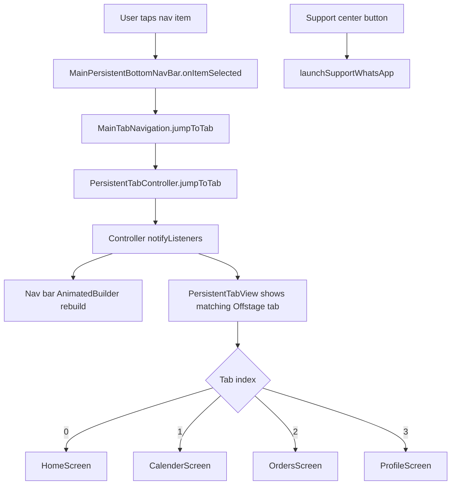

# Main Screen Bottom Navigation

Guide for recreating this app’s main shell (bottom nav + tab switching) in another Flutter app.

## Overview

The main UX shell is **not** Flutter’s built-in `BottomNavigationBar`. It uses:

| Piece | Role |
|-------|------|
| `MainScreen` | Shell that hosts all tabs |
| `PersistentTabView.custom` (`persistent_bottom_nav_bar`) | Keeps tabs alive and switches visibility |
| `MainPersistentBottomNavBar` | Custom 5-slot UI (4 tabs + center Support) |
| `MainTabNavigation` | Singleton that owns the tab controller and allows jumping tabs from anywhere |

**Dependency:** `persistent_bottom_nav_bar: ^6.2.1`

---

## File map

```
lib/features/main/
├── navigation/
│   └── main_tab_navigation.dart      # Singleton tab controller facade
└── view/
    ├── screens/
    │   └── main_screen.dart          # Shell + tab screens
    └── widgets/
        └── main_persistent_bottom_nav_bar.dart  # Custom nav bar UI
```

Tab content screens:

| Index | Screen | Feature |
|-------|--------|---------|
| 0 | `HomeScreen` | Home |
| 1 | `CalenderScreen` | Calendar |
| 2 | `OrdersScreen` | Orders |
| 3 | `ProfileScreen` | More / Profile |

Center slot **Support** is **not** a tab — it opens WhatsApp.

---

## Architecture flow



---

## 1. Shell: `MainScreen`

`MainScreen` is a `StatefulWidget` that:

1. Reads optional route params (`MainScreenParam`) for initial tab / orders filter
2. Creates and attaches a `PersistentTabController` via `MainTabNavigation`
3. Builds `PersistentTabView.custom` with 4 screens + custom nav bar
4. Listens for cross-tab orders-status requests and rebuilds `OrdersScreen`

### Key setup (`initState`)

```dart
_tabNavigation = MainTabNavigation.instance;

final requestedIndex =
    widget.mainScreenParam?.returnedPageIndex ??
    _tabNavigation.currentIndex;

_tabNavigation.configureInitialState(
  index: requestedIndex,
  ordersInitialStatus: widget.mainScreenParam?.ordersInitialStatus,
);

_ordersInitialStatus = _tabNavigation.consumePendingOrdersInitialStatus();

_tabController = _tabNavigation.createController();
_tabNavigation.attachController(_tabController);

_tabNavigation.ordersStatusRequestIdListenable.addListener(_ordersStatusListener);
```

### Key build

```dart
PersistentTabView.custom(
  context,
  controller: _tabController,
  itemCount: 4,
  navBarHeight: 84,
  backgroundColor: Colors.white,
  resizeToAvoidBottomInset: true,
  handleAndroidBackButtonPress: true,
  stateManagement: true, // keep tab state alive
  confineToSafeArea: true,
  screens: [
    const CustomNavBarScreen(screen: HomeScreen()),
    CustomNavBarScreen(screen: CalenderScreen()),
    CustomNavBarScreen(
      screen: OrdersScreen(
        initialStatus: _ordersInitialStatus,
        statusRequestId: _ordersStatusRequestId,
      ),
    ),
    const CustomNavBarScreen(screen: ProfileScreen()),
  ],
  customWidget: MainPersistentBottomNavBar(
    controller: _tabController,
    onItemSelected: (index) => _tabNavigation.jumpToTab(index),
    onSupportTap: () => launchSupportWhatsApp(context),
  ),
);
```

### Important package flags

| Flag | Meaning |
|------|---------|
| `stateManagement: true` | Tabs stay in memory (Offstage stack). First visit builds; later visits keep state. |
| `handleAndroidBackButtonPress: true` | Package handles Android back within nested tab navigators |
| `itemCount: 4` | Must match number of `screens` (Support is **not** counted) |

### Cleanup (`dispose`)

```dart
_tabNavigation.ordersStatusRequestIdListenable.removeListener(_ordersStatusListener);
_tabNavigation.detachController(_tabController);
_tabController.dispose();
```

### Route params

```dart
class MainScreenParam {
  final int returnedPageIndex;
  final String? ordersInitialStatus;

  MainScreenParam({
    required this.returnedPageIndex,
    this.ordersInitialStatus,
  });
}
```

Use when navigating to `/main` to open a specific tab (and optionally filter orders).

---

## 2. Tab controller facade: `MainTabNavigation`

Singleton so **any screen** can switch tabs without holding a `BuildContext` for the shell.

### Responsibilities

- Own / attach / detach `PersistentTabController`
- Remember last desired index when the shell is not mounted
- `jumpToTab(index, {ordersInitialStatus})` from anywhere
- Pass pending orders filter to `MainScreen` via a `ValueNotifier` request id

### Core API

```dart
class MainTabNavigation {
  MainTabNavigation._();
  static final MainTabNavigation instance = MainTabNavigation._();
  static const int tabCount = 4;

  bool jumpToTab(int index, {String? ordersInitialStatus}) {
    _initialIndex = _sanitizeIndex(index);
    _setPendingOrdersStatus(ordersInitialStatus, notify: true);
    final controller = _controller;
    if (controller == null) return false; // shell not mounted
    controller.jumpToTab(_initialIndex);
    return true;
  }
}
```

**Return value:** `true` if the controller is attached; `false` if `MainScreen` is not alive (caller should fall back to navigating to `/main`).

---

## 3. Custom nav bar UI: `MainPersistentBottomNavBar`

Visual layout (RTL-friendly row of 5 equal slots):

```
[ Home ] [ Calendar ] [ Support ] [ Orders ] [ More ]
   0          1         (action)      2         3
```

### How selection highlighting works

- Wraps UI in `AnimatedBuilder(animation: controller)`
- Reads `controller.index` as `selectedIndex`
- On tap: calls `onItemSelected(tabIndex)` → `MainTabNavigation.jumpToTab`
- Support tap: separate `onSupportTap` (no index change)

### Selected / inactive styling

- Selected: theme `primaryContainer` (icon + tinted circle)
- Inactive: `Color(0xff526D6B)`
- Support: always `error` color (never selected as a tab)

---

## 4. Switching tabs from other features

Pattern used across the app:

```dart
final opened = MainTabNavigation.instance.jumpToTab(
  2,
  ordersInitialStatus: status, // optional, for Orders tab
);

if (!opened) {
  // MainScreen not mounted — recreate shell on the desired tab
  context.pushRouteAndRemoveUntil(
    '/main',
    arguments: MainScreenParam(
      returnedPageIndex: 2,
      ordersInitialStatus: status,
    ),
  );
}
```

### Real call sites

| From | Target tab | Extra |
|------|------------|--------|
| Home incomplete profile | 3 (More) | — |
| Home status chip | 2 (Orders) | `ordersInitialStatus` |
| Work areas save | 3 (More) | — |
| Extension / global prompt OK | 0 (Home) | — |

---

## 5. Cross-tab data: Orders filter

When jumping to Orders with a status filter:

1. `jumpToTab(2, ordersInitialStatus: '...')` stores pending status and bumps `ordersStatusRequestId`
2. `MainScreen` listener runs → `setState` with new `initialStatus` + incremented `statusRequestId`
3. `OrdersScreen.didUpdateWidget` sees the new request id and refetches

This keeps Orders state alive (`stateManagement: true`) while still allowing a fresh filtered load when requested from another tab.

---

## 6. Nested navigation (two layers)

### A. Per-tab Navigator (package default)

`Navigator.of(context).push(...)` from inside a tab stays under that tab. The bottom bar can remain visible depending on the package / push style.

Examples: Home → Wallet, Profile → Update Profile / Reviews.

### B. Root app navigator

Named routes via `context.pushRoute('/orderdetails')` (root navigator) cover full-screen flows that typically hide the shell:

Examples: order details, notifications, work areas, login, `/main`.

When recreating: decide early which flows stay in-tab vs go to the root navigator.

---

## Checklist: recreate in another app

1. **Add dependency**
   ```yaml
   persistent_bottom_nav_bar: ^6.2.1
   ```

2. **Create singleton** `MainTabNavigation` (or rename) with:
   - `createController` / `attachController` / `detachController`
   - `jumpToTab` returning `bool`
   - optional pending payload pattern if tabs need cross-tab args

3. **Create shell screen** that:
   - configures initial index from route args
   - builds `PersistentTabView.custom` with `stateManagement: true`
   - passes `customWidget` for your nav bar
   - disposes / detaches the controller

4. **Create custom nav bar** that:
   - listens to `PersistentTabController` via `AnimatedBuilder`
   - maps UI slots to real tab indexes (skip non-tab actions)
   - calls `onItemSelected(index)` on tap

5. **Wrap each tab** in `CustomNavBarScreen(screen: ...)`

6. **Wire deep links / returns** with a param class like `MainScreenParam(returnedPageIndex: …)`

7. **From other screens**, prefer:
   ```dart
   MainTabNavigation.instance.jumpToTab(i)
   ```
   and fall back to navigating to the main route if it returns `false`

---

## What this app does *not* use for tabs

- Flutter `BottomNavigationBar` / `NavigationBar`
- GoRouter shell routes for the tab bar
- BLoC / Cubit for selected tab index (`MainBloc` / `MainNotifier` exist but are unused stubs)
- App-level `IndexedStack` / `PageView` (the package owns the Offstage stack)

---

## Minimal mental model

```
Tap tab
  → custom nav bar callback
  → MainTabNavigation.jumpToTab(i)
  → PersistentTabController.jumpToTab(i)
  → PersistentTabView shows screen[i] (kept alive)
  → nav bar rebuilds selected style from controller.index
```

That is the full control loop to copy into another app.
