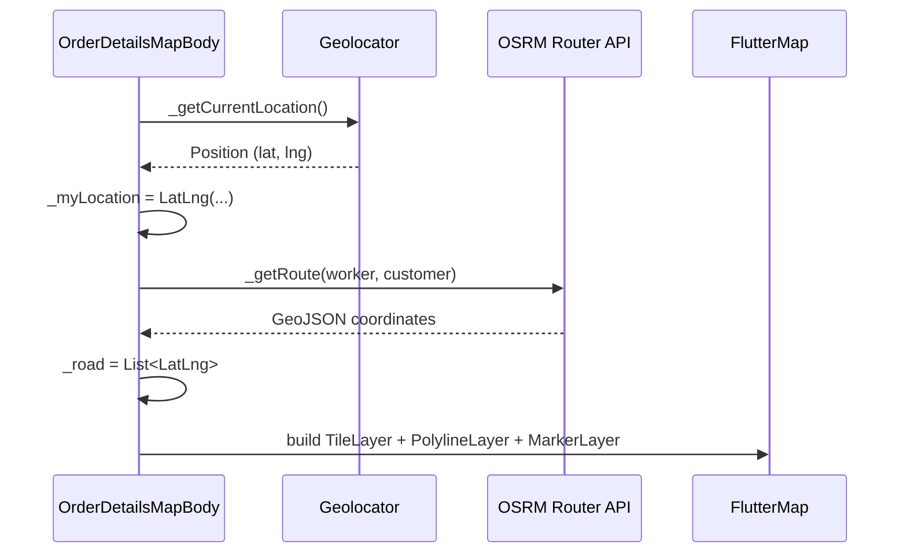

# Order Details Map — Map & Road Display

This document explains how `OrderDetailsMapBody` renders the map and driving route (road) for a cleaning worker en route to the customer.

**Source:** `order_details_map_body.dart`

---

## When this screen appears

`OrderDetailsMapBody` is shown from `order_details_screen.dart` when the order details wizard is on **step 2** (worker assigned and travel started, or awaiting customer verification / start confirmation).

```dart
if (!_canShowMissionBody && step == 2) {
  return OrderDetailsMapBody(
    order: _order,
    bloc: widget.params.bloc,
    index: widget.params.index,
  );
}
```

Step 2 is determined by `OrderLifecyclePolicy.detailsStepFor()` — typically `worker_assigned` with `startedTravelAt` set, or verification-related statuses.

---

## Dependencies

| Package | Role |
|---------|------|
| `flutter_map` | Map widget, tile layer, polyline, markers |
| `latlong2` | `LatLng` coordinates |
| `geolocator` | Device GPS position |
| `dio` | HTTP client for OSRM routing API |

Declared in `pubspec.yaml`:

- `flutter_map: ^8.2.2`
- `latlong2: ^0.9.1`
- `geolocator: ^14.0.2`

---

## High-level flow



1. **`initState`** calls `_loadInitialMap()`.
2. Worker position is read from GPS and stored in `_myLocation`.
3. Route points are fetched from OSRM and stored in `_road`.
4. **`build`** renders `FlutterMap` once `_myLocation` is available.

---

## Showing the map

### 1. Get worker location

`_getCurrentLocation()`:

- Ensures location services are enabled (opens settings if not).
- Requests/checks location permission (`denied` → request, `deniedForever` → app settings).
- Uses platform-specific settings:
  - **iOS/macOS:** `AppleSettings` with `bestForNavigation`, automotive activity, background updates.
  - **Android/other:** `LocationSettings(accuracy: LocationAccuracy.high)`.
- Returns a `Position` via `Geolocator.getCurrentPosition()`.

### 2. Store center point

```dart
_myLocation = LatLng(position.latitude, position.longitude);
```

### 3. Render `FlutterMap`

While `_myLocation == null`, a centered `CircularProgressIndicator` is shown.

Once location is ready:

```dart
FlutterMap(
  options: MapOptions(
    initialCenter: _myLocation!,
    initialZoom: 13,
  ),
  children: [
    TileLayer(
      urlTemplate: 'https://tile.openstreetmap.org/{z}/{x}/{y}.png',
      userAgentPackageName: 'com.dllni.clOwner',
    ),
    // PolylineLayer and MarkerLayer — see below
  ],
)
```

| Setting | Value | Purpose |
|---------|-------|---------|
| `initialCenter` | Worker's current GPS | Map opens centered on the worker |
| `initialZoom` | `13` | City/neighborhood level |
| Tiles | OpenStreetMap | Base map imagery |

The map fills the screen (`Positioned.fill`) under the app bar and draggable bottom sheet.

---

## Showing the road (route)

### 1. Customer destination

Route end point comes from the order model:

- `order.addressLatitude`
- `order.addressLongitude`

Parsed from API fields such as `addressLatitude` / `address_latitude` / `latitude` (see `fetch_orders_usecase_model.dart`).

If either coordinate is missing, `_road` is cleared and **no polyline or markers** are drawn.

### 2. Fetch route from OSRM

`_drawRoad(LatLng start)` calls `_getRoute(start, end)`:

**Endpoint:**

```
GET http://router.project-osrm.org/route/v1/driving/{lng},{lat};{lng},{lat}
```

**Query parameters:**

| Param | Value |
|-------|-------|
| `overview` | `full` |
| `geometries` | `geojson` |

**Coordinate order in URL:** `longitude,latitude` (OSRM convention).

**Response parsing:**

1. Read `routes[0].geometry.coordinates` (GeoJSON line).
2. Each coordinate is `[lng, lat]` — convert to `LatLng(lat, lng)` for `flutter_map`.
3. Store result in `_road`.

On network/parse failure, `_road` is set to an empty list (map still shows; route is hidden).

### 3. Draw the route on the map

Route UI is only rendered when `_road.isNotEmpty`.

#### Polyline (the road)

```dart
PolylineLayer(
  polylines: [
    Polyline(
      points: _road,
      strokeWidth: 5,
      color: Colors.blue,
    ),
  ],
),
```

#### Markers (start & end)

```dart
MarkerLayer(
  markers: [
    Marker(point: _road.first, ...),  // route start (worker side)
    Marker(point: _road.last, ...),   // route end (customer)
  ],
)
```

Both markers use a red `Icons.location_on` (40×40).

| Layer | Data source | Visible when |
|-------|-------------|--------------|
| `TileLayer` | OSM tiles | `_myLocation != null` |
| `PolylineLayer` | `_road` | `_road.isNotEmpty` |
| `MarkerLayer` | `_road.first` / `_road.last` | `_road.isNotEmpty` |

---

## State variables (map-related)

| Variable | Type | Meaning |
|----------|------|---------|
| `_myLocation` | `LatLng?` | Worker's GPS; map center |
| `_road` | `List<LatLng>` | OSRM route polyline points |
| `_dio` | `Dio` | HTTP client for routing |

---

## Initialization sequence

```
initState()
  └─ _loadInitialMap()
       ├─ _getCurrentLocation()  →  _myLocation
       └─ _drawRoad(_myLocation!)
            ├─ read order.addressLatitude / addressLongitude
            ├─ _getRoute(worker, customer)  →  OSRM
            └─ setState(() => _road = road)
```

Errors in `_loadInitialMap()` clear `_road` but do not block the map if `_myLocation` was set.

---

## Requirements checklist

For the map and road to display correctly:

- [ ] Device location permission granted
- [ ] Location services enabled
- [ ] Order has valid `addressLatitude` and `addressLongitude`
- [ ] Network access to:
  - `https://tile.openstreetmap.org/` (tiles)
  - `http://router.project-osrm.org/` (routing)
- [ ] `userAgentPackageName: 'com.dllni.clOwner'` set on `TileLayer` (OSM policy)

---

## Related behavior (not map rendering)

These run in the same widget but are separate from drawing the map/road:

| Feature | Mechanism |
|---------|-----------|
| Live location to backend | `Timer.periodic` every 4s → `ReportBookingLocationEvent` when `shouldReportWorkerLocation()` is true (`location_reporting_policy.dart`) |
| Arrive / verification UI | Bottom sheet actions, security code dialog, `ArriveEvent` |
| Location tracking pause | Stops when verification starts or worker taps "لقد وصلت" (`_suppressLocationReporting`) |

---

## Customization notes

| Change | Where to edit |
|--------|---------------|
| Map zoom / center | `MapOptions.initialZoom`, `initialCenter` |
| Route color / width | `Polyline` `color`, `strokeWidth` |
| Marker icons | `MarkerLayer` `child` widgets |
| Tile provider | `TileLayer.urlTemplate` |
| Routing provider | `_getRoute()` URL and response parsing |
| Re-fetch route on move | Call `_drawRoad()` from location tracking (not implemented today — route is loaded once at init) |

---

## Troubleshooting

| Symptom | Likely cause |
|---------|----------------|
| Spinner never disappears | GPS permission denied or location unavailable → `_myLocation` stays `null` |
| Map shows, no blue line | Missing customer coordinates or OSRM returned no routes |
| Map shows, no markers | Same as above (`_road` empty) |
| Wrong route shape | OSRM uses driving profile; coordinates swapped if lat/lng order is wrong in API payload |

---

## File references

| File | Role |
|------|------|
| `order_details_map_body.dart` | Map, route, UI |
| `order_details_screen.dart` | Hosts widget at step 2 |
| `location_reporting_policy.dart` | When to POST worker location |
| `order_lifecycle_policy.dart` | Step 2 / arrive / verification rules |
| `fetch_orders_usecase_model.dart` | `addressLatitude` / `addressLongitude` parsing |
